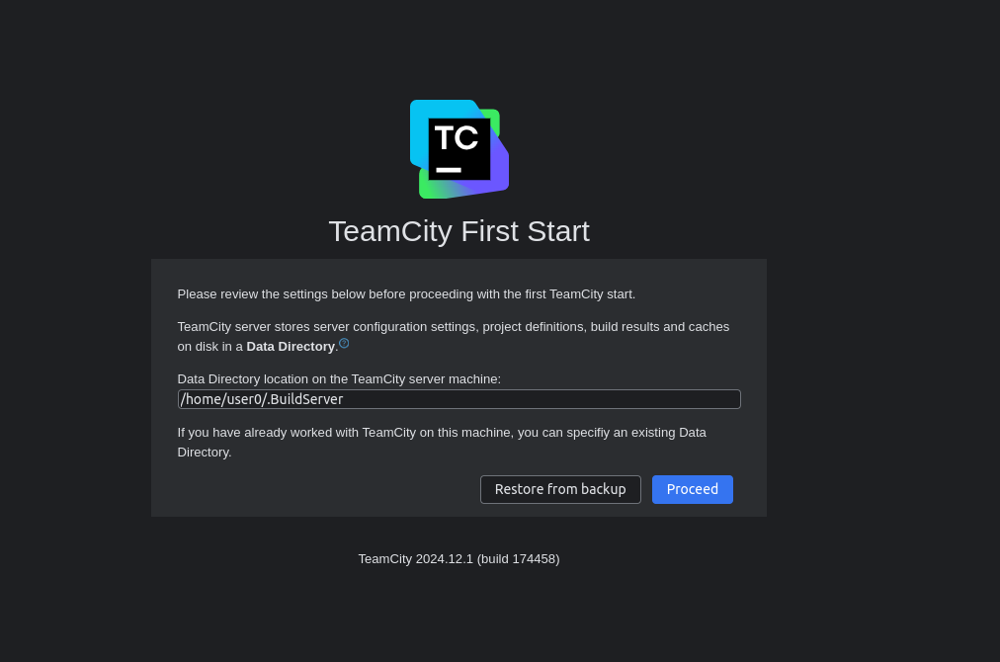
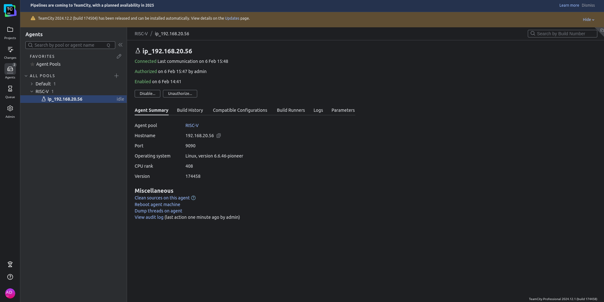

Setting up JetBrains TeamCity with RISC-V Runner
**************************************

JetBrains TeamCity is another build management and continuous integration server by JetBrains.

This page describes how users can host a TeamCity server with a RISC-V agent as a CI compute instance. The users will be able to run the builds on the CI agent of RISC-V.

Pre-Requisites
==============

1. An x86 machine running Linux (preferably Ubuntu) for hosting a TeamCity web server
2. A RISC-V machine running Linux (preferably Ubuntu) for running it as a build agent for the webserver
3. OpenJDK installed on both of the machines (here openjdk-21-jdk will be used)

OpenJDK can be installed on a RISC-V machine running Ubuntu using the following command.

.. code:: shell
   sudo apt install openjdk-21-jdk

In case openjdk is not available on your distribution of RISC-V, you can download the latest compiled binary from this `link <https://cloud-v.co/risc-v-resources>`

TeamCity Webserver Setup (on x86 machine)
=========================================

TeamCity web application (which is the front-end dashboard) does not have to be necessarily installed on a RISC-V machine. So it is recommended to set it up on an x86 machine to waive off any compatibility issues. In the end, the main goal is to be able to schedule builds on a RISC-V machine without worrying about what is scheduling the builds for execution.

To set up the TeamCity web server on an x86 machine, follow the steps below.

- Visit the `On-premises webserver <https://www.jetbrains.com/teamcity/download/#section=server>` link and enter your email and usecase
- Download the `Linux (.tar.gz)`
- Navigate to the directory where TeamCity tarball is downloaded and execute the following command to extract the compressed package in a new folder

.. code:: shell
   mkdir TeamCity
   tar -xf <path/to/teamcityTarball> -C TeamCity

- navigate inside the folder where TeamCity is extracted and use the following command to start the TeamCity Webserver

.. code:: shell
   ./bin/runAll.sh start

- After running the above command, you will output like following.

.. code::
 Spawning TeamCity restarter in separate process
 TeamCity restarter running with PID 17864
 Starting TeamCity build agent...
 Java executable is found: '/usr/lib/jvm/java-1.21.0-openjdk-amd64/bin/java'
 Starting TeamCity Build Agent Launcher...
 Agent home directory is /home/user0/Downloads/TeamCity/TeamCity/buildAgent
 Done [18391], see log at /home/user0/Downloads/TeamCity/TeamCity/buildAgent/logs/teamcity-agent.log

- According to the above output, the log for the server is saved at :code:`/home/user0/Downloads/TeamCity/TeamCity/buildAgent/logs/teamcity-agent.log`. Yours may be different. This log contains the information regarding which port the TeamCity server is running or if there was a problem launching the server. In this case, the port is 8111 on localhost
- After entering the URL of the TeamCity in the browser (in this case, it is localhost:8111), you will see a screen like the following

- Click on `Proceed` and on the next page, select the database. This setup is done with an `internal (HSQLDB)` database type
- Accept the License Agreement on the next page and then add a username and a password

TeamCity build agent Setup (on RISC-V machine)
=========================================

After setting up the server, you will see that the TeamCity server already has one `Default Agent` in the `Agents` menu on the left. To add a new RISC-V agent, follow the steps below.

- In the `Agents` menu, click on the `Install agent`
- Copy the link for `.zip` file and use that link to download the package on the riscv machine (this can be done via logging in via `ssh` and using wget or curl to download the package. One thing to note is that the link is relative to the TeamCity web server. In case if TeamCity web server is not publicly accessible, then the package cannot be downloaded via this link in which case, use this `link to download <https://cloud-v.co/risc-v-resources>` the build agent)
- Open the :code:`<installation path>\conf` directory and rename the :code:`buildAgent.dist.properties` file to :code:`buildAgent.properties`
- Give execute permissions to :code:`bin/agent.sh` and execute :code:`bin/agent.sh start` to start the agent process on the RISC-V machine
- Edit the :code:`<build_agent_DIR>/conf/buildAgent.properties` file and add the server URL of the TeamCity web server (the frontend which was set up in the previous section) in :code:`serverURL` variable
- Once this is set up, a new agent in the section `Agent` will appear in the `UNAUTHORIZED AGENTS` tab. Click on the agent and then `Authorize`
- Once the agent has successfully connected, it will be listed under the mentioned pools as shown in the image below

   